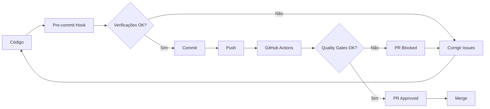

# Quality Gates Automáticos 🚦

Este documento descreve o sistema de Quality Gates implementado para garantir a qualidade do código e a estabilidade da aplicação.

## 📋 Visão Geral

O sistema de Quality Gates inclui:
- ✅ Verificações automáticas no CI/CD
- ✅ Hooks de pre-commit
- ✅ Validação de mensagens de commit
- ✅ Auditorias de performance
- ✅ Escaneamento de segurança

## 🔄 GitHub Actions Workflows

### 1. Code Health Check (`.github/workflows/code-health.yml`)
Executado em: `push` e `pull_request` para `main` e `develop`

**Verificações incluídas:**
- 📝 TypeScript compilation (`tsc --noEmit`)
- 🧹 ESLint analysis
- 🏗️ Build verification
- 🔒 Security audit (`npm audit`)
- 📊 Code health analysis
- 📦 Bundle size check
- 💬 PR comment com relatório de saúde

### 2. Performance Audit (`.github/workflows/performance-audit.yml`)
Executado em: `push` e `pull_request` para `main`

**Verificações incluídas:**
- 🚀 Lighthouse CI auditing
- 📦 Bundle size analysis
- ⚡ Performance budget validation (< 1MB)
- 📱 Mobile performance testing

### 3. Security Scan
**Verificações incluídas:**
- 🛡️ Trivy vulnerability scanning
- 📋 SARIF upload para GitHub Security tab
- 🔍 Dependency vulnerability check

## 🎣 Pre-commit Hooks

### Configuração automática com Husky

```bash
# Instalar e configurar
npm run prepare
```

### Pre-commit hook (`.husky/pre-commit`)
**Verificações executadas antes de cada commit:**
1. 📝 TypeScript check (`tsc --noEmit`)
2. 🧹 ESLint verification
3. 🏗️ Build test
4. 🩺 Quick health check

### Commit message validation (`.husky/commit-msg`)
**Formato obrigatório - Conventional Commits:**
```
type(scope): description

Tipos aceitos:
- feat: nova funcionalidade
- fix: correção de bug
- docs: documentação
- style: formatação
- refactor: refatoração
- test: testes
- chore: manutenção
- perf: performance
- ci: CI/CD
- build: build system
```

**Exemplos válidos:**
```
feat(auth): add user authentication
fix(ui): resolve mobile layout issue
docs: update API documentation
```

## 📊 Code Health Scoring

### Métricas avaliadas:
- **TypeScript Issues** (peso: 25%)
- **ESLint Issues** (peso: 20%)
- **Security Issues** (peso: 25%)
- **Bundle Size** (peso: 15%)
- **Test Coverage** (peso: 15%)

### Scoring:
- 🟢 **80-100**: Excelente qualidade
- 🟡 **60-79**: Qualidade boa, melhorias recomendadas
- 🟠 **40-59**: Qualidade regular, melhorias necessárias
- 🔴 **0-39**: Qualidade baixa, correções obrigatórias

## 🚀 Comandos Disponíveis

```bash
# Quality Gates completos
npm run quality:gates

# Verificações pre-commit
npm run quality:pre-commit

# Auditoria de segurança
npm run quality:audit

# Análise detalhada de saúde
npm run health-check

# Análise rápida de saúde
npm run health-check:quick

# Análise de bundle
npm run bundle:size

# Setup inicial dos Quality Gates
node scripts/setup-quality-gates.js
```

## 🔧 Configuração para Novos Desenvolvedores

### 1. Primeira configuração:
```bash
npm install
npm run prepare
node scripts/setup-quality-gates.js
```

### 2. Verificar configuração:
```bash
npm run quality:gates
```

### 3. Testar pre-commit:
```bash
git add .
git commit -m "test: validate quality gates setup"
```

## 📈 Performance Budgets

### Bundle Size Limits:
- **Main bundle**: < 1MB
- **CSS bundle**: < 200KB
- **Assets total**: < 5MB

### Lighthouse Scores (mínimos):
- **Performance**: > 90
- **Accessibility**: > 95
- **Best Practices**: > 90
- **SEO**: > 90

## 🛡️ Segurança

### Verificações automáticas:
- Dependency vulnerabilities (npm audit)
- Code vulnerabilities (Trivy)
- Secrets detection
- License compliance

### Níveis de severidade:
- **Critical**: Falha obrigatória
- **High**: Falha obrigatória
- **Moderate**: Warning com revisão
- **Low**: Informativo

## 🚨 Bypass de Emergência

### Em caso de urgência crítica:
```bash
# Skip pre-commit hooks (NÃO RECOMENDADO)
git commit --no-verify -m "urgent: critical fix"

# Skip apenas verificações específicas
SKIP_HEALTH_CHECK=true git commit -m "fix: urgent patch"
```

⚠️ **Importante**: Bypasses devem ser raros e sempre seguidos de correção imediata.

## 📋 Checklist para Pull Requests

Antes de criar um PR, verificar:
- [ ] ✅ TypeScript compilation successful
- [ ] ✅ ESLint checks pass  
- [ ] ✅ Build successful
- [ ] ✅ Code health score > 80
- [ ] ✅ Security audit clean
- [ ] ✅ Bundle size within limits
- [ ] ✅ Performance budget met
- [ ] ✅ Tests passing
- [ ] ✅ Mobile testing done

## 🔄 Workflow de Desenvolvimento



## 📞 Suporte

Para problemas com Quality Gates:
1. Verificar logs detalhados no GitHub Actions
2. Executar `npm run health-check` localmente
3. Revisar este documento
4. Contatar equipe de DevOps

---

🎯 **Objetivo**: Manter alta qualidade de código e prevenir regressões através de verificações automatizadas em múltiplas camadas.
